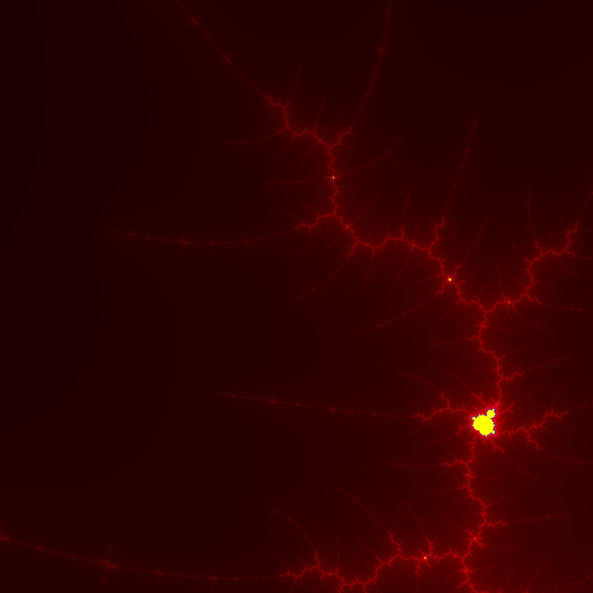

# Mandelbrot Set
This code base is my walkthrough of the Mandelbrot set tutorial by [Bartosz Zaczyński](https://realpython.com/mandelbrot-set-python/#author) published at [reapython.com](https://realpython.com/) 

## Here is the tutorial:
https://realpython.com/mandelbrot-set-python/

## Here are some great links:
[What's so special about the Mandelbrot Set? - Numberphile](https://www.youtube.com/watch?v=FFftmWSzgmk)  
[Newton's method... - 3Blue1Brown](https://www.youtube.com/watch?v=-RdOwhmqP5s)  
[Beyond the Mandelbrot set... - 3Blue1Brown](https://www.youtube.com/watch?v=LqbZpur38nw)  

## A Python specific learning from this Tutorial:
https://docs.python.org/3/library/dataclasses.html

## This is just the beginning:
This was a fascinating exploration of the power of code.  I'm looking forward to playing around with this more in the future!

## Here are some images I was able to generate:

